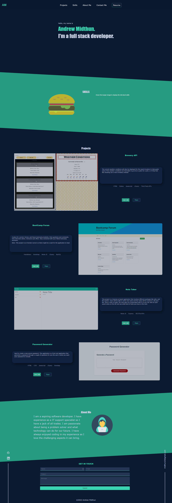

  # My Portfolio

   
  
  ## Table of Contents 

  * [Description](#description)
  
  * [Screenshots](#screenshots)

  * [License](#license)

  * [Questions](#questions)

  ## Description

  This is my own portfolio displaying my expertise skills that I have attained in the world of web development. The project includes projects that I have made and contributed to, skills that I have achieved in both back end and front end web development. A downloadable pdf of my resume. A brief about me section describing my journey and a contact me to form at the bottom.
  
  ## Screenshots
 
  
  
  ## License

  This project is licensed under the MIT license 

  ## Questions
  
  If you have any questions about the repo, open an issue contact me directly at [midthun23@gmail.com](mailto:midthun23@gmail.com). You can find more work at [midth002](https://github.com/midth002)
  